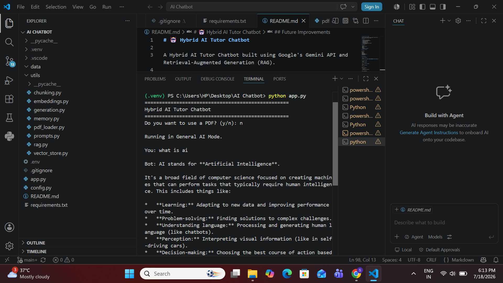

# 🤖 Hybrid AI Tutor Chatbot

A Hybrid AI Tutor Chatbot built using **Google Gemini API** and **Retrieval-Augmented Generation (RAG)** to answer questions from uploaded PDF documents while also supporting general AI conversations.

---

## ✨ Features

- 📄 Chat with PDF documents
- 🤖 General AI chat powered by Gemini
- 🧠 Conversation memory
- 🔍 FAISS vector similarity search
- 📚 Retrieval-Augmented Generation (RAG)
- 📝 Automatic PDF text extraction and chunking
- ⚡ Configurable generation parameters
- 🛡 Robust error handling

---

## 🛠 Tech Stack

- Python
- Google Gemini API
- FAISS
- NumPy
- pdfplumber
- LangChain Text Splitter
- python-dotenv

---

## 📂 Project Structure

```text
Hybrid-AI-Tutor-Chatbot/
│
├── utils/
│   ├── chunking.py
│   ├── embeddings.py
│   ├── generation.py
│   ├── memory.py
│   ├── pdf_loader.py
│   ├── prompts.py
│   ├── rag.py
│   └── vector_store.py
│
├── data/
├── app.py
├── config.py
├── requirements.txt
├── .gitignore
└── README.md
```

---

## 🚀 Installation

### 1. Clone the repository

```bash
git clone https://github.com/SakshiG13arg/Hybrid-AI-Tutor-Chatbot.git
```

### 2. Navigate to the project directory

```bash
cd Hybrid-AI-Tutor-Chatbot
```

### 3. Create a virtual environment

```bash
python -m venv .venv
```

### 4. Activate the virtual environment

**Windows (PowerShell)**

```powershell
.\.venv\Scripts\Activate.ps1
```

### 5. Install dependencies

```bash
pip install -r requirements.txt
```

### 6. Create a `.env` file

```text
GEMINI_API_KEY=YOUR_API_KEY
```

### 7. Run the chatbot

```bash
python app.py
```

---

## 💡 How It Works

1. Upload a PDF (optional).
2. The chatbot extracts and chunks the document.
3. Gemini Embedding API converts chunks into vector embeddings.
4. FAISS indexes the embeddings for semantic search.
5. User questions are embedded and matched with the most relevant chunks.
6. Retrieved context and conversation history are combined into a prompt.
7. Gemini generates a context-aware response.

---

## 📌 Current Capabilities

- Hybrid AI chatbot (General + PDF mode)
- Retrieval-Augmented Generation (RAG)
- Semantic search using FAISS
- Conversation memory
- PDF-based Question Answering
- Configurable Gemini generation settings
- Modular Python architecture

## Demo


